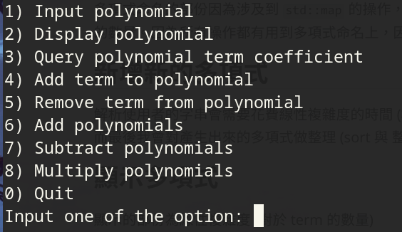

# 使用者介面介紹

基本上是一個互動式 terminal 介面的 User Interface

基本上按下 0 ~ 8 就會執行對應的功能。

# 複雜度分析
多項式命名的部份使用了自製的 Hash map，因此時間複雜度是期望 $ \mathcal{O}(1) $ 最差$\mathcal{O}(n)$，其中 $n$ 是目前有名字的多項式的數量。陣列部份在 C 語言模仿 C++ 的 `std::vector` 的實作來處理多項式，基本上也是 array 的想法，只是沒有多項式項數儲存上限。
## 新增新的多項式
解析使用者的字串會需要花費線性複雜度的時間 (相對於字串長度) 。
而最後我會對產生出來的多項式做整理 (sort 與 整理) ，這些操作都是 $\mathcal{O}(m)$ ，其中 $m$ 是多項式 term 的數量。

## 顯示多項式
顯示的部份為線性複雜度 (對於 term 的數量)
## 尋找多項式的特定項
單純的線性掃描，是線性複雜度 (對於 term 的數量)
## 新增項給多項式
線性搜尋對的位置後，擴充陣列大小 (`realloc`)，再搬移元素並插入，若忽略 `realloc` 實作所花費的時間，時間複雜度是$\mathcal{O}(n)$
## 從多項式中移除項
搜尋陣列中要移除的項後，透過覆寫的方式刪除該項，並於陣列大小記數中 -1。總體是線性複雜度 (對於 term 的數量而言)

## 加減多項式
基本實作的概念是直式加減法，將加（減）好的結果存入暫存容器裡面，總共花費 $\mathcal{O}(n+m)$ 的時間複雜度（同時也花費 $\mathcal{O}(n+m)$ 的空間複雜度），其中 $n$ 與 $m$ 是兩個運算元的 term 數。因為複製暫存容器的時間也是線性的，因此暫存容器的複製時間不影響複雜度。總體時間複雜度依舊是 $\mathcal{O}(n+m)$ 。
## 對多項式做乘法
使用了直式乘法的想法，應該只需要花費 $\mathcal{O}(n*m)$ 的時間複雜度，其中 $n$ 與 $m$ 是兩個運算元 term 的數量。這裡也一樣會花費 $\mathcal{O}(n*m)$ 的空間複雜度作為暫存空間。這裡與加減一樣使用了暫存容器，複製暫存容器時間複雜度同乘法的演算時間複雜度，因此總體時間複雜度依舊維持 $\mathcal{O}(n*m)$ 。

# 魔幻的自製 Hash Map

這個 Hash map 為 C string 對應 `void*`，採用了兩次 hash，第一次的 hash 作為 index，第二個 hash 是在 hash 碰撞時檢測 key 是否相同用的，理論上兩個 hash 都碰撞的機率極低，若真的不巧遇到的話 Hash map 將絕對性的出現錯誤。

Hash 的長度為 `int32_t`，不可能有陣列可以存下這麼大的範圍，我採用了 8 層的指標陣列，前面 7 層指向後一層，最後一層指向一個 Linked list，含有著 key 對應的 value。這八層指標陣列將 32bit 的 index 切成了長度為 4 的小指標陣列，在需要時才分配空間，減少空間花費，以達到可以覆蓋 `int32_t` 範圍的假想陣列。

細部實做可以詳閱程式碼，基本上這個 hash map 非常粗糙，使用的空間大概是 C++ 的 `std::unordered_map` 的兩倍，在元素量多的時候依舊表現不夠理想。
